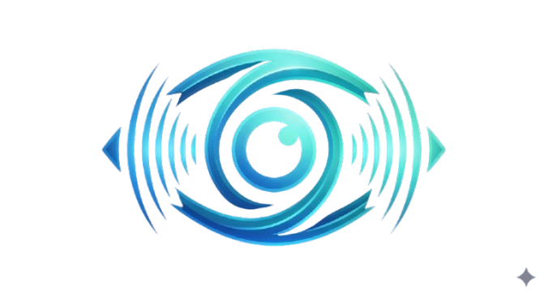
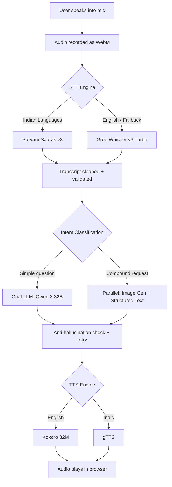
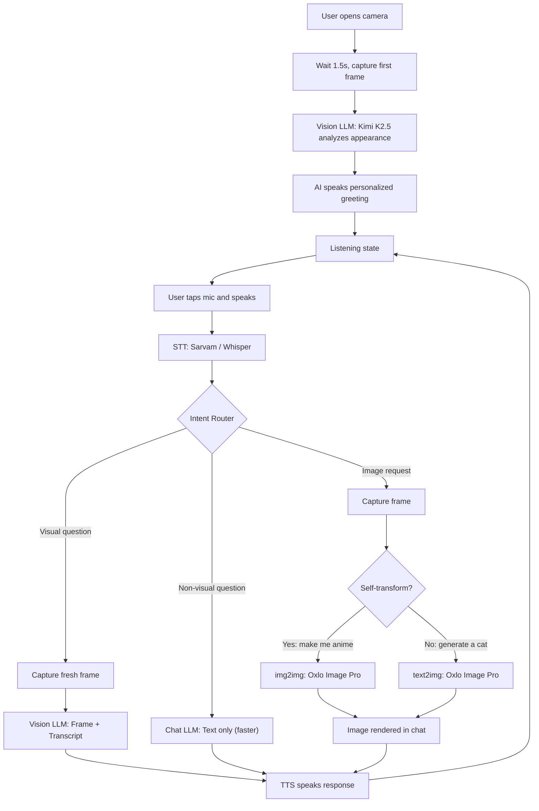

<p align="center">
  
</p>

<h1 align="center">Oxlo VoxVision.ai</h1>

<p align="center">
  <strong>Multimodal AI Assistant : Voice, Vision & Image Generation</strong><br/>
  Built for the <a href="https://oxlo.ai">Oxlo.ai Hackathon</a>
</p>

<p align="center">
  
  
  
  
</p>

---

## What is VoxVision?

A multimodal AI assistant that can **hear you, see you, speak back, and generate images** all in one interface. It combines real-time voice conversation, live webcam vision, object detection, and AI image generation powered by **Oxlo.ai's multi-model API**.

**Supported Languages**: English, Hindi, Kannada, Tamil, Telugu, Spanish, French, Japanese

---

## Features

###  Voice Mode
- Hold-to-speak mic with real-time audio waveform
- Dual-engine STT (Sarvam Saaras primary, Groq Whisper fallback)
- Streaming LLM responses with anti-hallucination validation
- Natural TTS (Kokoro for English, gTTS for Indic languages)
- Compound requests: *"Show me a chocolate cake and give me the recipe"*

###  Vision Mode
- Live webcam with AI-powered visual awareness
- Personalized greeting on camera open (sees your outfit, expression, environment)
- Toggle-mic voice chat with smart intent routing:
  - **Visual questions** → captures frame + Vision LLM
  - **Non-visual questions** → skips camera, uses faster text LLM
- Real-time YOLOv11 object detection with bounding box overlays
- Image generation from camera: *"Make me look anime"* → img2img transform

###  Creative Vision Features
| Feature | What It Does |
|---------|-------------|
| **What If** | Reimagines your scene: *"What if this was underwater?"* → new image + narration |
| **Biographies** | Fictional life story for any detected object with AI-generated origin illustration |
| **Director** | Turns your camera view into a movie poster with genre, title, tagline & trailer script |

###  Image Generation
- **img2img**: Camera frame → styled portrait (anime, cartoon, superhero, traditional, 17+ styles)
- **text2img**: Text prompt → generated image (Oxlo Image Pro / FLUX.1 Schnell)
- Automatic model fallback and 1024x1024 output

---

## Architecture

###  Voice Mode Flow



###  Vision Mode Flow



---

## AI Models Used

###  Large Language Models (LLM)
| Model | Role | Provider |
|-------|------|----------|
| **Kimi K2.5** | Primary Chat & Vision LLM (text + multimodal) | Oxlo.ai |
| **Qwen 3 32B** | Voice Mode LLM, fast inference, strong Indic languages | Oxlo.ai |
| **DeepSeek R1 70B** | Chat fallback #1 (when Kimi hits rate limits) | Oxlo.ai |
| **Llama 4 Maverick 17B** | Chat & Vision fallback #2 | Oxlo.ai |
| **Ministral 14B** | Chat & Vision fallback #3 | Oxlo.ai |
| **Llama 3 70B** | Final Groq text fallback (when all Oxlo models fail) | Groq |

###  Speech-to-Text (STT)
| Model | Role | Provider |
|-------|------|----------|
| **Sarvam Saaras v3** | Primary STT, Indian-language optimized (verbatim mode) | Sarvam AI |
| **Whisper Large v3 Turbo** | Fallback STT, broad multilingual, ultra-fast | Groq |
| **Whisper Large v3** | Secondary fallback STT | Oxlo.ai |

###  Text-to-Speech (TTS)
| Model | Role | Provider |
|-------|------|----------|
| **Kokoro 82M** | English & Latin-script TTS, high-quality neural voice | Oxlo.ai |
| **gTTS** | Indic language TTS: Hindi, Kannada, Tamil, Telugu, Japanese | Google |

###  Computer Vision
| Model | Role | Provider |
|-------|------|----------|
| **YOLOv11** | Real-time multi-object detection with bounding boxes | Oxlo.ai |

###  Image Generation
| Model | Role | Provider |
|-------|------|----------|
| **Oxlo Image Pro** | Primary image gen: text2img + img2img (camera to styled portrait) | Oxlo.ai |
| **FLUX.1 Schnell** | Fast fallback image generation | Oxlo.ai |

---

## Tech Stack

**Backend**: Python 3.11+, FastAPI, Uvicorn, OpenAI SDK, Pydantic, httpx, gTTS, sarvamai

**Frontend**: React 19, TypeScript, Vite, Tailwind CSS, Framer Motion, Lucide Icons

---

## Quick Start

### Prerequisites
- Python 3.11+, Node.js 18+, npm 9+

### Backend
```bash
cd backend
python -m venv venv
venv\Scripts\activate        # Windows
# source venv/bin/activate   # macOS/Linux
pip install -r requirements.txt
python main.py               # Runs on http://localhost:8000
```

### Frontend
```bash
cd frontend
npm install
npm run dev                  # Runs on http://localhost:5173
```

### Environment Variables

Create `backend/.env`:
```env
OXLO_API_KEY=your_oxlo_api_key
GROQ_API_KEY=your_groq_api_key
SARVAM_API_KEY=your_sarvam_api_key
```

| Variable | Required | Description |
|----------|----------|-------------|
| `OXLO_API_KEY` | Yes | Oxlo.ai API key (LLM, Vision, TTS, Image, YOLO) |
| `GROQ_API_KEY` | Yes | Groq API key (Whisper STT fallback) |
| `SARVAM_API_KEY` | Recommended | Sarvam AI key (Indian-language STT) |

---

## API Endpoints

| Endpoint | Description |
|----------|-------------|
| `POST /api/voice/pipeline` | Full voice pipeline (STT → LLM → TTS) |
| `POST /api/vision/analyze` | Scene analysis + object detection |
| `POST /api/vision/voice/greeting` | First-frame personalized greeting |
| `POST /api/vision/voice/pipeline` | Vision voice pipeline (audio + frame) |
| `POST /api/vision/whatif` | What If Reality Engine |
| `POST /api/vision/biography` | Object Biography |
| `POST /api/vision/director` | Scene Director |
| `POST /api/image/generate` | Text-to-image / img2img |
| `POST /api/compound/generate` | Compound request (image + text) |

---

## What Makes It Different

- **Sees you, hears you, talks back**: true multimodal, not just text
- **Smart intent routing**: skips camera for non-visual questions, saving 2-5s per turn
- **Native Indic language output**: Kannada in ಕನ್ನಡ script, not transliteration
- **Recapture feedback**: asks you to reposition when it can't see clearly
- **Anti-hallucination**: post-generation validation with automatic retry
- **One API, many models**: Kimi, Qwen, Kokoro, YOLOv11, FLUX via single Oxlo.ai key
- **Compound requests**: generates image + structured text + voice in one turn

---

## License

Built for the Oxlo.ai Hackathon. All AI model inference powered by [Oxlo.ai](https://oxlo.ai).
