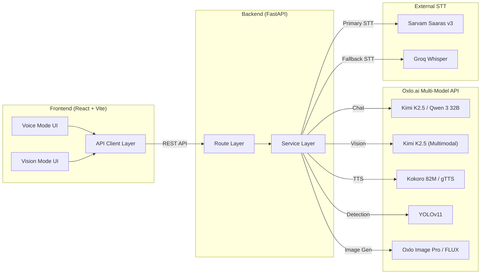
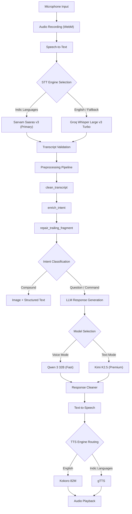
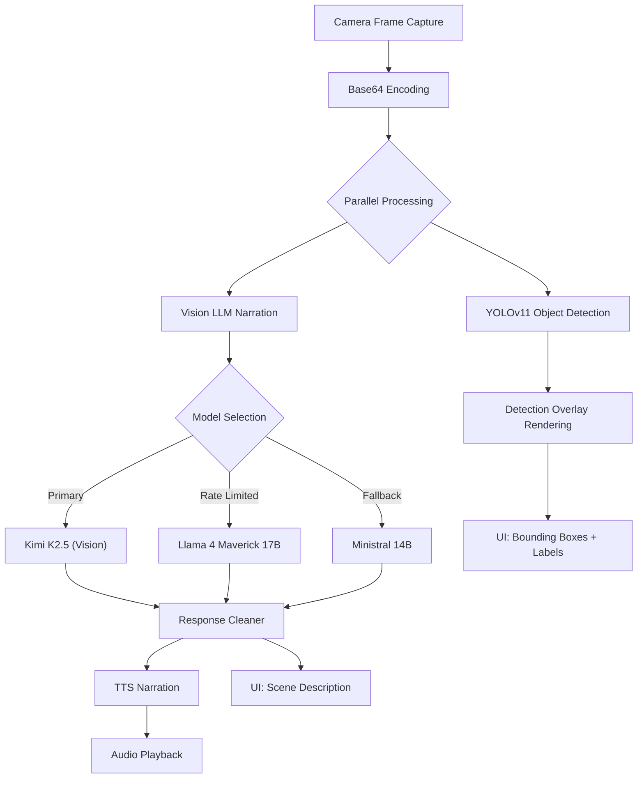
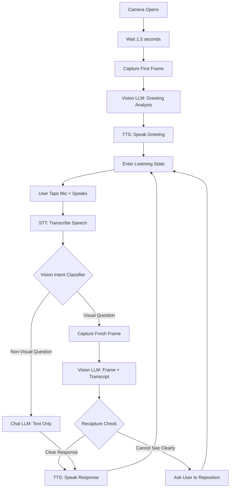

# Oxlo VoxVision.ai

A multimodal AI assistant built for the **Oxlo.ai Hackathon** that combines voice interaction, real-time computer vision, and image generation into a single web application. The entire system is powered by the **Oxlo.ai multi-model API**, which provides unified access to a diverse set of open-source AI models (Kimi K2.5, Qwen 3, Kokoro, YOLOv11, FLUX, and more) through a single API key and OpenAI-compatible endpoint. The frontend is built with React + TypeScript (Vite), and the backend runs on Python FastAPI, with additional STT support from Sarvam AI and Groq for Indian-language and English speech recognition respectively.

---

## Project Overview

Oxlo VoxVision.ai is a multimodal AI assistant that can hear, see, speak, and generate images. It provides two primary interaction modes accessible through a glassmorphism-styled web interface:

- **Voice Mode**: A full-duplex voice assistant with multilingual support, real-time speech-to-text, LLM-powered response generation, and natural text-to-speech output.
- **Vision Mode**: An AI assistant with live visual awareness through the user's webcam. It can greet users based on their appearance, answer visual questions, detect objects in real time, and run creative vision features like scene reimagination, object storytelling, and movie poster generation.

The system supports eight languages (English, Hindi, Kannada, Tamil, Telugu, Spanish, French, Japanese) with native script output for all Indic languages.

---

## How It Works

The application opens in a browser with two tabs at the top: **Voice** and **Vision**. Each mode operates as a separate, self-contained AI assistant experience.

### High-Level System Overview



### Voice Mode: Step-by-Step

1. The user opens the app and lands on the **Voice** tab. An animated orb pulses in the center as visual feedback.
2. The user holds the microphone button and speaks their question in any supported language.
3. Audio is recorded as WebM and sent to the backend `/api/voice/pipeline` endpoint.
4. The backend runs the **STT pipeline**: Sarvam Saaras v3 (primary, Indian-language optimized) transcribes the audio. If Sarvam fails or confidence is low, Groq Whisper automatically takes over as fallback.
5. The raw transcript is cleaned, validated, and classified by intent (question, command, compound request).
6. For compound requests (e.g., "show me a chocolate cake with recipe"), the system generates an image and structured text in parallel. For standard questions, the transcript is sent to the **Chat LLM** (Qwen 3 32B for voice, Kimi K2.5 for text mode).
7. The LLM response passes through an anti-hallucination validator. If the output is incomplete or contains formatting artifacts, it is automatically regenerated (up to 2 retries).
8. The validated response text is sent to **TTS**: English routes to Kokoro 82M (neural voice), Indian languages route to gTTS (native script pronunciation).
9. The audio is streamed back and played in the browser. The transcript and response appear as chat bubbles in the UI.

### Vision Mode: Step-by-Step

1. The user switches to the **Vision** tab and clicks **Open Camera**.
2. The browser requests webcam permission and opens the camera feed.
3. After a 1.5-second warm-up, the system automatically captures the **first frame** and sends it to the Vision LLM.
4. The Vision LLM analyzes the frame with a focus on the **person** (clothing, expression, accessories, environment) and generates a personalized greeting.
5. The greeting is spoken aloud through TTS. The AI then enters a **listening state**, indicated by a green pulsing mic icon.
6. The user taps the mic to toggle recording, speaks a question, then taps again to stop.
7. The backend transcribes the audio (same STT pipeline as Voice Mode), then runs a **Vision Intent Classifier** to determine if the question needs the camera.
8. If the question is visual (e.g., "How am I looking?", "What is this?"), a fresh frame is captured and sent alongside the transcript to the Vision LLM for a visual answer.
9. If the question is non-visual (e.g., "Tell me a joke", "What is 2+2?"), the frame is skipped entirely and the question goes to the faster text-only Chat LLM.
10. The response is spoken through TTS and displayed as a chat bubble. If the Vision LLM could not see clearly, the system asks the user to reposition and waits for the next attempt.

### Creative Features: Step-by-Step

From the Vision Mode toolbar, the user can switch to three creative features:

- **What If**: The user types or selects a scenario (e.g., "What if this was underwater?"). The system describes the current scene, reimagines it using the scenario, generates a new image, and narrates the transformation.
- **Biographies**: The user taps a detected object. The AI writes a fictional origin story for that object and generates an illustration of its past.
- **Director**: With one click, the AI treats the current camera view as a movie still, picks a genre, writes a title/tagline/trailer script, and generates a professional movie poster.

---

## Features

### Voice Mode

The voice assistant provides hands-free conversational AI with a complete speech pipeline.

**Capabilities**:
- Hold-to-speak microphone with real-time audio recording
- Dual-engine speech-to-text with automatic fallback (Sarvam Saaras v3 primary, Groq Whisper fallback)
- Intent classification (question, command, conversational) for response optimization
- Anti-hallucination LLM response generation with retry logic
- Natural text-to-speech with language-aware engine routing (Kokoro for English, gTTS for Indic)
- Conversation history retention across turns
- Structured output formatting for recipes, tutorials, and step-by-step guides
- Compound request handling: generates both an image and structured text from a single prompt (e.g., "Show me a chocolate cake and give me the recipe")
- Real-time pipeline metadata display (ASR confidence, detected language, intent, model used)

**Supported Languages**: English, Hindi, Kannada, Tamil, Telugu, Spanish, French, Japanese

### Vision Mode

The vision module transforms the user's webcam into an AI-powered visual interface with two distinct capabilities.

#### AI Vision (Smart Voice + Vision Chat)

A conversational assistant with visual awareness. When the camera opens, the system:

1. Captures the first frame and sends it to a Vision LLM
2. Generates a personalized greeting describing the user's appearance and environment
3. Speaks the greeting through TTS
4. Enters a listening state where the user can ask questions via toggle-mic

For each user utterance, a regex-based intent classifier determines whether the question requires visual context. Visual questions (e.g., "How am I looking?", "What is this in my hand?") trigger a fresh frame capture and Vision LLM analysis. Non-visual questions (e.g., "What is 2 plus 2?") skip the camera entirely and route to a faster text-only LLM, reducing latency.

If the Vision LLM cannot see clearly, a recapture feedback loop asks the user to adjust lighting, hold objects closer, or reposition.

#### Creative Vision Features

Three creative features that combine Vision LLM analysis with AI image generation:

- **What If Reality Engine**: Reimagines the camera scene under an alternate scenario (e.g., "What if this was underwater?", "What if this was cyberpunk?"). The system describes the current scene, generates a reimagined image prompt, produces the new image, and narrates the transformation.
- **Object Biographies**: Selects a detected object and generates a fictional life story with cinematic narration, accompanied by an AI-generated image of the object's origin.
- **Scene Director**: Treats the camera frame as a movie still, generates a genre classification, movie title, tagline, trailer script, and a professional movie poster image.

#### Object Detection

YOLOv11-based real-time object detection runs in parallel with scene narration. Detected objects are displayed as bounding box overlays on the camera feed and as labeled chips in the insights panel.

### Image Generation

A standalone image generation feature accessible through compound requests. Supports two models with automatic fallback:
- **Oxlo Image Pro**: Primary high-quality image generation
- **FLUX.1 Schnell**: Fast fallback model

Images are generated at 1024x1024 resolution by default with base64 encoding for direct display.

### Compound Requests

The system detects multi-intent prompts that require both image generation and structured text output. For example, asking "Show me a chocolate cake with the recipe" triggers:
1. Domain detection (food, DIY, character, design, general)
2. Image generation of the subject
3. Structured text generation with domain-specific formatting (ingredients + steps for food, materials + instructions for DIY)
4. A short TTS-friendly voice summary

---

## System Architecture

### Voice Pipeline



### Vision Pipeline



### Vision Voice Pipeline



---

## Models and Technologies

### AI Models

| Component | Model | Provider | Purpose |
|-----------|-------|----------|---------|
| Chat LLM (Primary) | Kimi K2.5 | Oxlo.ai | Premium chat with vision capabilities |
| Chat LLM (Fallback) | DeepSeek R1 70B, Llama 4 Maverick 17B, Ministral 14B | Oxlo.ai | Fallback chain for rate limits |
| Voice LLM | Qwen 3 32B | Oxlo.ai | Fast inference optimized for Indian languages |
| Vision LLM | Kimi K2.5 | Oxlo.ai | Multimodal image understanding |
| STT (Primary) | Sarvam Saaras v3 | Sarvam AI | Indian-language optimized speech recognition |
| STT (Fallback) | Whisper Large v3 Turbo | Groq | Broad multilingual STT with ultra-fast inference |
| TTS (English) | Kokoro 82M | Oxlo.ai | High-quality English speech synthesis |
| TTS (Indic) | gTTS | Google | Native Kannada, Tamil, Telugu, Hindi speech |
| Object Detection | YOLOv11 | Oxlo.ai | Real-time multi-object detection |
| Image Gen (Primary) | Oxlo Image Pro | Oxlo.ai | Premium text-to-image generation |
| Image Gen (Fast) | FLUX.1 Schnell | Oxlo.ai | Fast fallback image generation |

### Backend Stack

| Technology | Version | Purpose |
|------------|---------|---------|
| Python | 3.11+ | Runtime |
| FastAPI | 0.115.0 | Async REST API framework |
| Uvicorn | 0.30.6 | ASGI server |
| OpenAI SDK | 1.51.0 | API client for Oxlo.ai and Groq |
| Pydantic | 2.9.2 | Request/response validation |
| httpx | 0.27.2 | Async HTTP client for YOLO detection |
| gTTS | 2.5.3 | Google Translate TTS for Indic languages |
| sarvamai | 0.1.0+ | Sarvam AI STT client |
| python-dotenv | 1.0.1 | Environment variable management |

### Frontend Stack

| Technology | Version | Purpose |
|------------|---------|---------|
| React | 19.2.4 | UI framework |
| TypeScript | 5.9.3 | Type-safe JavaScript |
| Vite | 8.0.1 | Build tool and dev server |
| Tailwind CSS | 4.2.2 | Utility-first CSS framework |
| Framer Motion | 12.38.0 | Animation library |
| Lucide React | 1.7.0 | Icon library |
| Radix UI | Latest | Accessible primitives (Switch, Tooltip) |

---

## Folder Structure

```
Oxlovoxxission_ai/
├── backend/
│   ├── main.py                          # FastAPI entry point, router registration, CORS
│   ├── requirements.txt                 # Python dependencies
│   ├── .env                             # API keys (OXLO_API_KEY, GROQ_API_KEY, SARVAM_API_KEY)
│   └── app/
│       ├── config.py                    # Model IDs, token limits, language config, sampling params
│       ├── models/
│       │   └── schemas.py               # Pydantic models for all request/response types
│       ├── routes/
│       │   ├── voice.py                 # Voice pipeline endpoints (/api/voice/*)
│       │   ├── vision.py               # Vision analysis endpoints (/api/vision/*)
│       │   ├── vision_voice.py          # Smart vision voice endpoints (/api/vision/voice/*)
│       │   ├── image.py                 # Image generation endpoint (/api/image/*)
│       │   └── compound.py             # Compound request endpoint (/api/compound/*)
│       └── services/
│           ├── oxlo_client.py           # Shared OpenAI-compatible API clients (oxlo, oxlo_fast, groq)
│           ├── chat_service.py          # LLM chat with anti-hallucination, retry, multilingual
│           ├── stt_service.py           # STT orchestrator (Sarvam primary, Whisper fallback)
│           ├── sarvam_stt_service.py    # Sarvam Saaras v3 STT implementation
│           ├── whisper_service.py       # Groq Whisper STT implementation
│           ├── tts_service.py           # TTS with language-aware engine routing
│           ├── vision_service.py        # Scene narration with parallel detection
│           ├── vision_voice_service.py  # Smart vision voice assistant brain
│           ├── vision_creative_service.py # What If, Biographies, Scene Director
│           ├── yolo_service.py          # YOLOv11 object detection via Oxlo API
│           ├── image_service.py         # Image generation with model fallback
│           ├── compound_service.py      # Multi-intent orchestration (image + text)
│           ├── intent_service.py        # Intent classification for user queries
│           ├── language_service.py       # Language detection, script analysis, TTS config
│           ├── preprocessing_service.py  # Transcript cleaning, validation, enrichment
│           └── response_cleaner.py      # Post-generation response formatting and cleanup
├── frontend/
│   ├── index.html                       # HTML entry point with meta tags
│   ├── package.json                     # Node dependencies
│   ├── vite.config.ts                   # Vite configuration with proxy
│   ├── tsconfig.json                    # TypeScript configuration
│   └── src/
│       ├── App.tsx                      # Root component with mode switcher
│       ├── main.tsx                     # React entry point
│       ├── index.css                    # Global styles
│       ├── api/
│       │   ├── voice.ts                 # Voice pipeline API client
│       │   ├── vision.ts               # Vision analysis API client
│       │   ├── visionVoice.ts           # Smart vision voice API client
│       │   ├── image.ts                 # Image generation API client
│       │   └── compound.ts             # Compound request API client
│       ├── components/
│       │   ├── VoiceMode.tsx            # Voice assistant UI (recorder, waveform, chat)
│       │   ├── VisionMode.tsx           # Vision assistant UI (camera, insights, chat)
│       │   ├── ImageMode.tsx            # Image generation UI
│       │   ├── AnimatedOrb.tsx          # Voice mode animated orb visualization
│       │   ├── DetectionOverlay.tsx     # YOLO bounding box canvas overlay
│       │   ├── VisionBackground.tsx     # Ambient particle background
│       │   ├── ParticleBackground.tsx   # Voice mode particle animation
│       │   ├── WaveformBars.tsx         # Audio waveform visualization
│       │   ├── Transcript.tsx           # Message/transcript display component
│       │   ├── StatusBadge.tsx          # Pipeline status indicator
│       │   ├── ModeToggle.tsx           # Voice/Vision mode toggle
│       │   └── MiniAIAssistant.tsx      # Compact AI assistant widget
│       ├── hooks/
│       │   ├── useVoiceRecorder.ts      # Audio recording hook (MediaRecorder API)
│       │   ├── useWebcam.ts             # Webcam capture hook with frame caching
│       │   └── useVAD.ts               # Voice Activity Detection hook
│       ├── types/
│       │   └── index.ts                 # TypeScript type definitions
│       └── utils/
│           ├── textCleaners.ts          # Client-side response text cleanup
│           └── audioUtils.ts            # Audio playback utilities
└── README.md
```

---

## Setup Instructions

### Prerequisites

- Python 3.11 or later
- Node.js 18 or later
- npm 9 or later

### Backend Setup

```bash
# Navigate to the backend directory
cd backend

# Create a virtual environment
python -m venv venv

# Activate the virtual environment
# Windows:
venv\Scripts\activate
# macOS/Linux:
source venv/bin/activate

# Install dependencies
pip install -r requirements.txt

# Create .env file with API keys (see Environment Variables section)

# Start the server
python main.py
```

The backend runs on `http://localhost:8000`. API documentation is available at `http://localhost:8000/docs`.

### Frontend Setup

```bash
# Navigate to the frontend directory
cd frontend

# Install dependencies
npm install

# Start the development server
npm run dev
```

The frontend runs on `http://localhost:5173` and proxies API requests to the backend.

### Environment Variables

Create a `.env` file in the `backend/` directory:

```env
OXLO_API_KEY=your_oxlo_api_key
GROQ_API_KEY=your_groq_api_key
SARVAM_API_KEY=your_sarvam_api_key
```

| Variable | Required | Description |
|----------|----------|-------------|
| OXLO_API_KEY | Yes | API key for Oxlo.ai (LLM, Vision, TTS, Image Gen, YOLO) |
| GROQ_API_KEY | Yes | API key for Groq (Whisper STT fallback) |
| SARVAM_API_KEY | Recommended | API key for Sarvam AI (Primary Indic STT). Falls back to Groq Whisper if not set. |

---

## API Reference

| Endpoint | Method | Description |
|----------|--------|-------------|
| `/api/health` | GET | Health check |
| `/api/voice/pipeline` | POST | Full voice pipeline (audio upload, STT, LLM, TTS) |
| `/api/voice/transcribe` | POST | Audio-only transcription |
| `/api/voice/speak` | POST | Text-to-speech synthesis |
| `/api/vision/analyze` | POST | Scene analysis with detection + narration |
| `/api/vision/speak` | POST | Narrate text with TTS |
| `/api/vision/whatif` | POST | What If Reality Engine |
| `/api/vision/biography` | POST | Object Biography generation |
| `/api/vision/director` | POST | Scene Director movie package |
| `/api/vision/voice/greeting` | POST | First-frame personalized greeting |
| `/api/vision/voice/pipeline` | POST | Full vision voice pipeline (audio + frame) |
| `/api/image/generate` | POST | Text-to-image generation |
| `/api/compound/generate` | POST | Multi-intent compound request |

---

## Use Cases

### Personal Assistant

Use Voice Mode as a hands-free assistant for everyday tasks. Ask questions in English or any supported Indian language, get recipes with step-by-step instructions, set up quick calculations, or have general knowledge conversations. The multilingual support makes it accessible to users who are more comfortable speaking in Hindi, Kannada, Tamil, or Telugu.

### Interview and Outfit Check

Open Vision Mode before a job interview, date, or important meeting. The AI sees you through the webcam and gives honest, constructive feedback on your outfit, grooming, and overall presentation. Ask "Am I dressed well for an interview?" and get a visual assessment with suggestions.

### Object Identification and Cooking Assistance

Point your camera at ingredients on your kitchen counter and ask "What can I cook with these?" The Vision Intent Classifier detects the visual nature of the question, captures a frame, identifies the ingredients through the Vision LLM, and suggests recipes.

### Accessibility for Visually Impaired Users

The voice-first design combined with visual awareness makes the system useful as a seeing assistant. Users can point the camera at objects, labels, or text and ask "What does this say?" or "What is this?" to get spoken descriptions.

### Education and Language Learning

Students can use Voice Mode in their native language (Kannada, Tamil, Telugu, Hindi) to ask academic questions and receive answers in native script. The system never transliterates, ensuring users read and hear responses in their own script.

### Creative Content Generation

Use the creative vision features to generate unique content from everyday scenes:
- **What If** transforms a boring desk setup into a cyberpunk workspace or underwater office for social media content.
- **Object Biographies** creates fictional backstories for everyday objects, useful for creative writing prompts.
- **Scene Director** turns any room into a movie poster, useful for fun, presentations, or film project ideation.

### Product and Label Reading

Point the camera at a product, package, or label and ask the AI to read and describe it. The Vision LLM identifies brand names, nutritional information, and product details, then speaks them aloud.

---

## What Makes It Different

Most AI assistants operate in a single modality: text-only chatbots, voice-only speakers, or image-only analyzers. Oxlo VoxVision.ai combines all four modalities (voice, vision, text, and image generation) into a single, unified experience where the AI can hear you, see you, respond to you in speech, and generate images on demand.

### It can see you and respond accordingly

Unlike standard voice assistants that only process audio, this system has live visual awareness. When the camera opens, the AI looks at the user, describes what it sees, and uses that visual context throughout the conversation. If you ask "How am I looking?", it actually looks at you and responds based on what it sees, not with a generic answer.

### It knows when to look and when not to

The Vision Intent Classifier is a key differentiator. Most vision systems process every frame regardless of whether the user's question needs it. This system analyzes the transcript first and only activates the camera pipeline when the question genuinely requires visual input. Asking "What is the capital of France?" skips the camera entirely, saving 2 to 5 seconds of latency per non-visual turn.

### It speaks Indian languages natively

Many multilingual AI systems transliterate responses into Latin script (e.g., "Namaskara" instead of "ನಮಸ್ಕಾರ"). This system enforces native script output at both the LLM prompt level and the TTS engine level. Kannada responses are generated in Kannada script and spoken with Kannada pronunciation. The same applies for Tamil, Telugu, and Hindi.

### It does not hallucinate recipes

The anti-hallucination system is not just a system prompt. It includes domain-specific grounding rules (e.g., tea recipes must not include butter), post-generation validation that checks response completeness, and automatic regeneration with up to two retries when the output fails quality checks.

### It tells you when it cannot see

Instead of guessing when the image is blurry, dark, or too far, the system detects uncertainty phrases in the Vision LLM's response and proactively asks the user to reposition. This recapture feedback loop ensures the user gets accurate visual answers rather than fabricated descriptions.

### It runs multiple AI models through one API

The entire system accesses Kimi K2.5, Qwen 3 32B, Kokoro 82M, YOLOv11, Oxlo Image Pro, and FLUX.1 Schnell through a single Oxlo.ai API key with an OpenAI-compatible endpoint. This eliminates the complexity of managing multiple provider accounts, SDKs, and billing systems. Sarvam AI and Groq are the only external APIs used, specifically for STT where specialized engines outperform general-purpose ones.

### It generates images alongside structured content

Compound request handling is not common in voice assistants. When a user says "Show me a chocolate cake and give me the recipe", the system detects two intents, generates the image first, then produces a formatted recipe with ingredients and step-by-step instructions, and speaks a short summary through TTS. The user gets the image, the full text, and the voice response in a single turn.

---

## Key Highlights

**Multi-Engine STT with Quality Arbitration**: The speech-to-text pipeline runs Sarvam Saaras v3 as primary (optimized for Indian languages with "verbatim" mode that preserves intent-critical words) and Groq Whisper as fallback. When both engines produce results, a quality arbiter selects the better transcript based on confidence scores, intent keyword preservation, and language detection.

**Vision Intent Classifier**: A regex-based intent classifier runs in under 1ms and determines whether a user's spoken question requires the webcam frame. Non-visual questions skip camera processing entirely, reducing latency by 2 to 5 seconds per turn. Supports English, Hindi, Kannada, Tamil, and Telugu trigger patterns.

**Anti-Hallucination System**: The chat service includes a production-grade anti-hallucination prompt block that enforces factual accuracy, domain-specific grounding (no butter in regular tea), and self-validation before response delivery. Failed validation triggers automatic regeneration with up to two retry attempts.

**Rate-Limit Aware Model Fallback**: The vision service tracks Kimi K2.5 rate limits at the module level. When a 429 is detected, the system blocks Kimi for 90 seconds and immediately falls back to Llama 4 Maverick 17B or Ministral 14B without waiting for SDK retries.

**Parallel Processing**: Vision analysis runs object detection (YOLO) and scene narration (Vision LLM) simultaneously using asyncio.gather, halving the total response time compared to sequential execution.

**Recapture Feedback Loop**: When the Vision LLM indicates it cannot see clearly (detecting phrases like "too dark", "too blurry", "too far"), the system automatically asks the user to reposition, adjust lighting, or hold objects closer, then waits for the next speech input to try again with a fresh frame.

**Language-Aware TTS Routing**: English and Latin-script languages route to Kokoro 82M for high-quality neural speech. Indian languages (Kannada, Tamil, Telugu, Hindi) route to gTTS with native script output, ensuring correct pronunciation without transliteration.

**Personalized Visual Greeting**: When the camera opens in Vision Mode, the AI captures the first frame, analyzes the user's appearance (clothing, expression, accessories, environment), and delivers a natural, friend-like greeting through voice before entering conversation mode.

---

## License

This project was built for the Oxlo.ai Hackathon. All AI model inference is provided through the Oxlo.ai platform.
